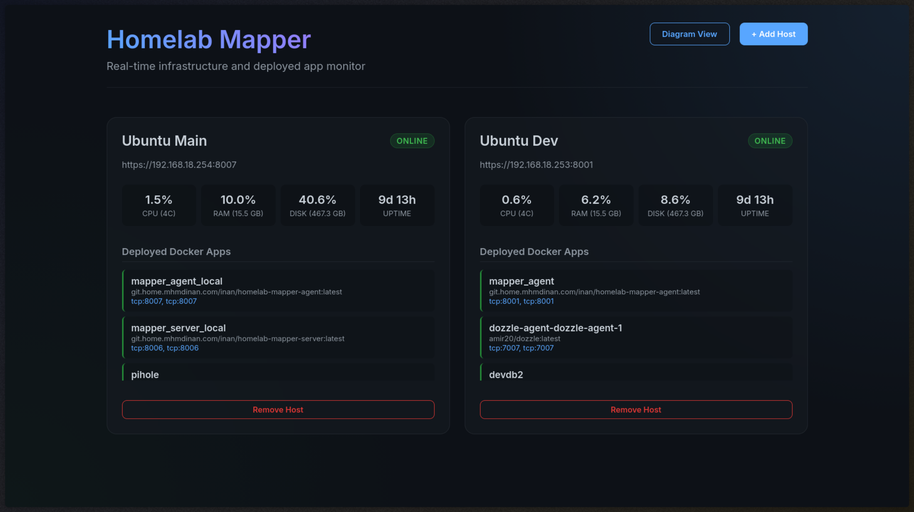
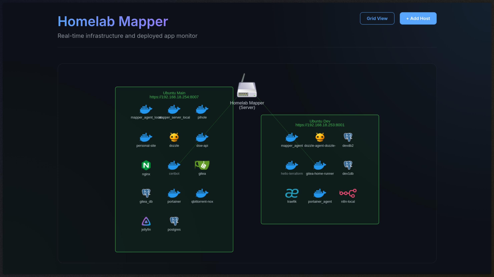
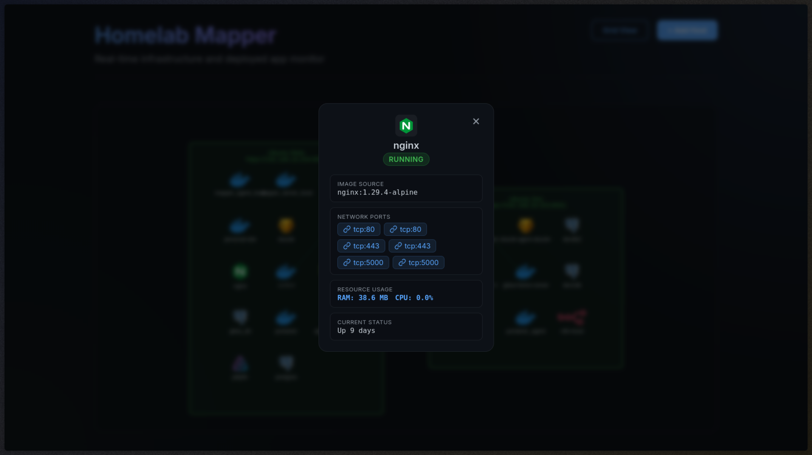

# Homelab Mapper

A lightweight, secure, and modern tool to automatically map and monitor the hosts and deployed Docker apps in your homelab.  
**Disclaimer:** This project was built with the help of AI and is not intended for professional deployment

<figure>
  
  <figcaption>Dashboard view of hosts.</figcaption>
</figure>   

<figure>
  
  <figcaption>Diagram showing visual of containers deployed on each host.</figcaption>
</figure>  

<figure>
  
  <figcaption>Clicking on a container provides its detail via a popup.</figcaption>
</figure>  

## Architecture

This project consists of two components:
1. **Agent (`/agent`)**: A Go binary that runs on each of your homelab hosts. It collects system metrics (CPU, RAM, Uptime) and queries the local Docker socket to list running container apps. It serves this data over a secure, authenticated, and self-signed HTTPS endpoint.
2. **Server (`/server`)**: A Go backend with an embedded SQLite database. It polls configured Agents securely and serves a beautiful, glassmorphism-styled web dashboard to visualize your entire homelab.

## CI/CD Pipeline

This repository is configured with **Gitea Actions**. The pipeline (`.gitea/workflows/ci.yml`) automatically runs Go tests for both components and builds the Docker images (`homelab-mapper-server:latest` and `homelab-mapper-agent:latest`) whenever code is pushed to the `main` branch.

## Quick Start (Combined Evaluation)

If you want to test the server and agent together on the same machine without building locally, you can use the combined compose file:

```bash
docker-compose up -d --build
```

Then visit `http://localhost:8080` in your browser. You can add the local agent by specifying the URL `https://mapper_agent_local:8443` and token `token`.

## Production Deployment

### 1. Deploy the Server
Deploy the server on your primary management node using the `docker-compose.server.yml` file.

```bash
docker-compose -f docker-compose.server.yml up -d
```
Access the dashboard at `http://<server-ip>:<server port, default is 8080>`.

### 2. Deploy Agents on your Hosts
On every machine in your homelab you want to monitor, deploy the agent using the `docker-compose.agent.yml` file. 
**Important**: Make sure to update the `AUTH_TOKEN` in the file to something secure.

```bash
docker-compose -f docker-compose.agent.yml up -d
```

### 3. Link them up
Go to the server dashboard, click **+ Add Host**, and enter:
* **Name**: `Name of server`
* **URL**: `https://<agent-ip>:<agent port, default is 8443>`
* **API Token**: `<your-secure-token>`

The server will automatically start polling the agent and mapping your systems and deployed apps!
